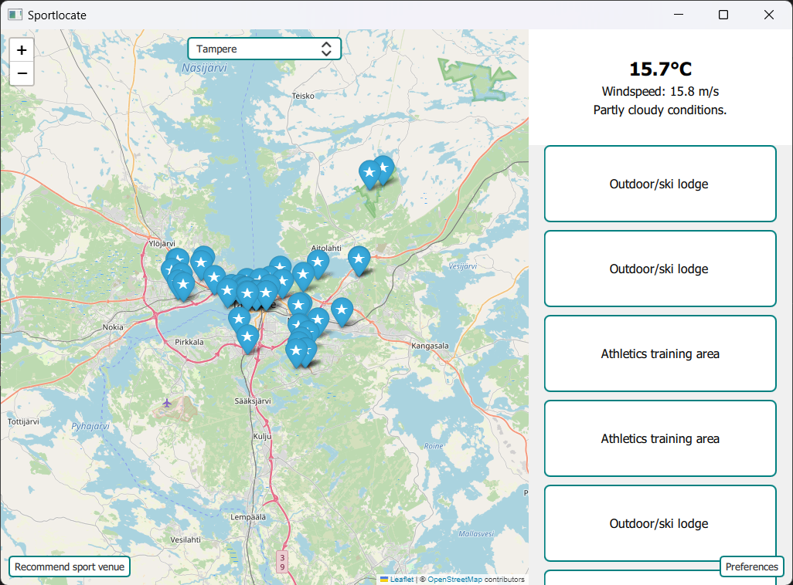

# SportLocate

SportLocate is an application that gives sport venue recommendations based on user location and weather.




## Requirements
- `python3.9` or above


## Installation

Following instructions are done with `Powershell`.


Create virtual enviroment:
````
python -m venv venv
````

Next activate virtual enviroment:
````
.\venv\Scripts\activate
````

Install programs needed packages with command:
````
pip install -e .
````

After that the program can be run with the command:
````
python .\sportlocate\__main__.py
````

This is our Software design course group project that we made 2023.


